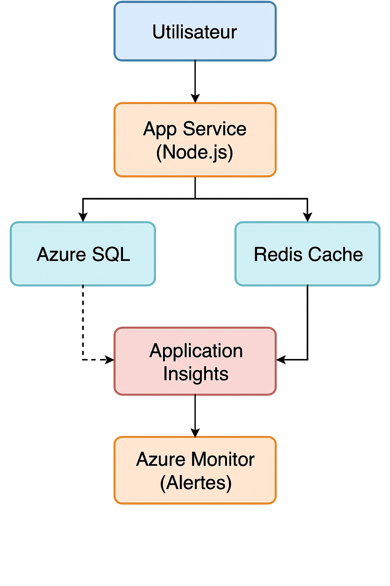
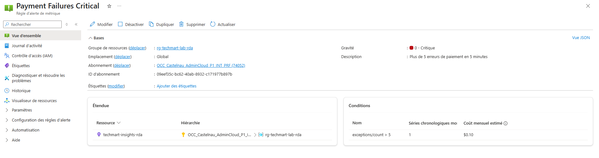
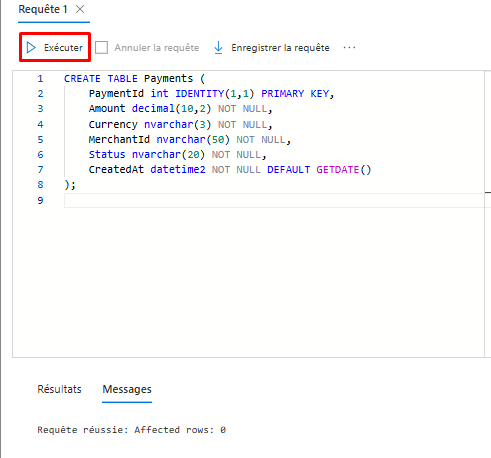
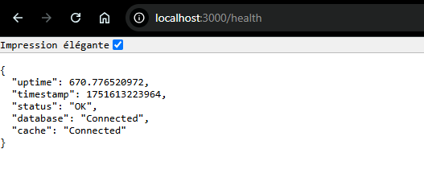
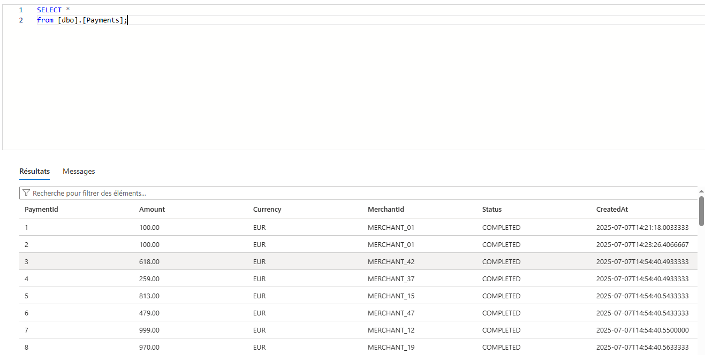
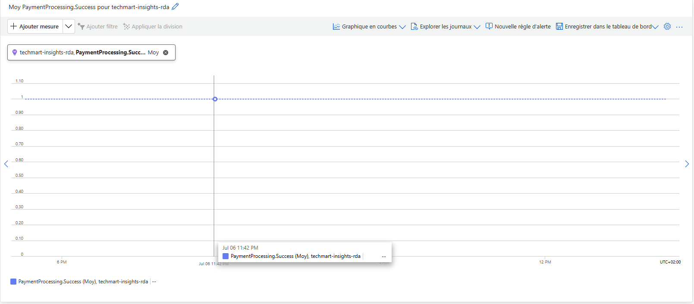
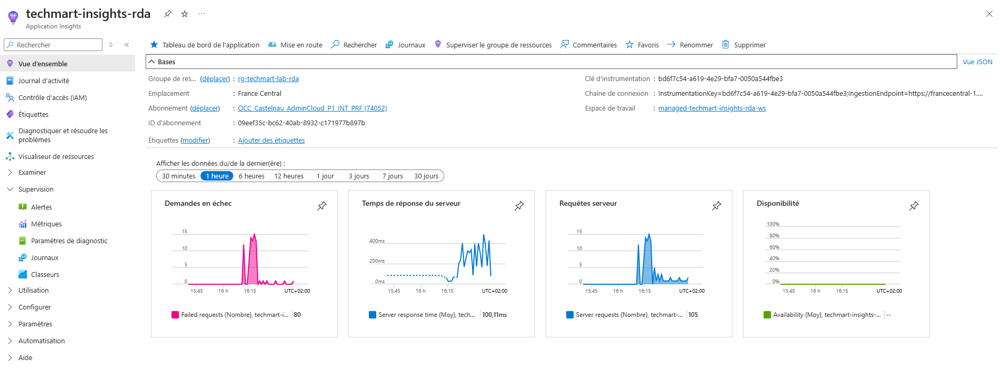

# TechMart Payment API – Déploiement Azure & Monitoring

## 🔍 Objectif
Mettre en place une infrastructure Azure robuste pour une API de paiement avec monitoring avancé et bonnes pratiques DevOps.

## 🔄 Architecture

```
[ Utilisateur ]
     |
[ App Service (Node.js) ]
     |
+----+------------------+
|                     |
[ Azure SQL ]       [ Redis Cache ]
     |
[ Application Insights ]
     |
[ Azure Monitor (Alertes) ]
```



## 📈 Choix techniques et justification

### Pourquoi choisir **Azure SQL niveau S0** ?
-  **Coût optimisé** : Idéal pour un usage startup avec charges modérées.
-  **Montée en charge facile** : Possibilité d'évoluer vers S1/S2 ou vCore.
-  **Haute disponibilité native (99,99%)**.
-  Utilisation pour environnements **DEV, TEST** ou faible volumétrie.

### Quand migrer vers un niveau supérieur ?
-  Volume de données important (plusieurs millions d'enregistrements)
-  Temps de réponse insuffisant
-  Pic de charge ou augmentation du trafic
-  Besoins en réplication géographique ou résilience accrue

### Pourquoi utiliser **Redis Cache** ?
-  Accélérer les temps de réponse
-  Décharger la base de données principale
-  Gestion des sessions utilisateurs, files d'attente, cache temporaire

### Quand Redis est-il indispensable ?
| Cas d'usage                               | Redis ? |
|-------------------------------------------|---------|
| Données fréquemment lues (mais peu modifiées) | Oui     |
| Sessions utilisateur / Token              | Oui     |
| Faible trafic                             | Non     |
| Données critiques, sensibles              | Non (à éviter sans sécurité) |

## 🚧 Déploiement Azure CLI

### Groupe de ressource
```bash
az group create --name rg-techmart-lab --location "France Central"
```

### Serveur SQL + Base de données
```bash
az sql server create \
  --name techmart-sql-$(whoami) \
  --resource-group rg-techmart-lab \
  --location "France Central" \
  --admin-user techmartadmin \
  --admin-password "DevOps@2024!"

az sql db create \
  --resource-group rg-techmart-lab \
  --server techmart-sql-$(whoami) \
  --name paymentsdb \
  --service-objective S0
```

### Redis Cache
```bash
az redis create \
  --name techmart-cache-$(whoami) \
  --resource-group rg-techmart-lab \
  --location "France Central" \
  --sku Basic \
  --vm-size c0
```

### App Service & déploiement de l'API
```bash
az appservice plan create \
  --name techmart-plan \
  --resource-group rg-techmart-lab \
  --sku S1 \
  --is-linux

az webapp create \
  --name techmart-payments-$(whoami) \
  --plan techmart-plan \
  --resource-group rg-techmart-lab \
  --runtime "NODE|18-lts"
```

## 🔍 Monitoring & Application Insights
```bash
az monitor app-insights component create \
  --app techmart-insights \
  --location "France Central" \
  --resource-group rg-techmart-lab \
  --application-type web
```

### Alertes sur les erreurs de paiement
```bash
az monitor metrics alert create \
  --name "Payment Failures Critical" \
  --resource-group rg-techmart-lab \
  --scopes /subscriptions/$(az account show --query id -o tsv)/resourceGroups/rg-techmart-lab/providers/Microsoft.Insights/components/techmart-insights \
  --condition "count exceptions/count > 5" \
  --description "Plus de 5 erreurs de paiement en 5 minutes" \
  --evaluation-frequency 1m \
  --window-size 5m \
  --severity 0
```


### Alerte sur la performance
```bash
az monitor metrics alert create \
  --name "Payment Response Time" \
  --resource-group rg-techmart-lab-rda \
  --scopes /subscriptions/<subscription-id>/resourceGroups/rg-techmart-lab-rda/providers/Microsoft.Insights/components/techmart-insights \
  --condition "avg requests/duration > 2000" \
  --description "Temps de réponse des paiements > 2s" \
  --evaluation-frequency 1m \
  --window-size 5m \
  --severity 2
```
[Payment Response](images/reponse-time.png)

## Variables d'environnement 

```bash
DB_USER
DB_PASSWORD
DB_NAME
DB_SERVER
REDIS_HOST
REDIS_PASSWORD
APPINSIGHTS_INSTRUMENTATIONKEY
```

## Création de la table SQL : 
```bash
CREATE TABLE Payments (
    PaymentId int IDENTITY(1,1) PRIMARY KEY,
    Amount decimal(10,2) NOT NULL,
    Currency nvarchar(3) NOT NULL,
    MerchantId nvarchar(50) NOT NULL,
    Status nvarchar(20) NOT NULL,
    CreatedAt datetime2 NOT NULL DEFAULT GETDATE()
);

CREATE INDEX IX_Payments_MerchantId_CreatedAt ON Payments(MerchantId, CreatedAt);
```


## Préparation du package de déploiement (ZIP) et déploiement sur Azure

### Préparation du projet

1. Assurez-vous d'avoir dans votre dossier projet : 
```bash
index.js
package.json
.deployment
```
2. Le fichier `.deployment` contient :
```bash
[config]
SCM_DO_BUILD_DURING_DEPLOYMENT=true
```
3. Ne pas inclure : 
  - `.env` (les variables sont configurées dans Azure App Service)
  - `node_modules` (Azure les installera automatiquement)

### Génération du fichier ZIP

1. Dans votre terminal local :
```bash
npm install --production
zip -r app.zip index.js package.json .deployment
```
2. Le fichier ZIP doit contenir uniquement : 
```bash
index.js
package.json
.deployment
```

### Déploiement du ZIP sur Azure

1. Dans PowerShell Windows (⚠️Pas WSL Ni Cloud Shell⚠️):
```bash
az login
az webapp deploy `
  --resource-group rg-techmart-lab-rda `
  --name techmart-payments-rda `
  --src-path "C:\Users\utilisateur\Desktop\VOTRECHEMIN\app.zip"
```
2. Résultat attendu :
  - L'application est déployé avec succès.
  - Vous pouvez accéder à :
  ```https://techmart-payments-rda.azurewebsites.net/health```
  et
  ```https://techmart-payments-rda.azurewebsites.net/api/payments```



## 🛠️ Tests & Simulation de Charge
```bash
for i in {1..50}; do
  curl -X POST https://techmart-payments-$(whoami).azurewebsites.net/api/payments \
    -H "Content-Type: application/json" \
    -d '{"amount":100,"currency":"EUR","merchantId":"MERCHANT_$i"}' &
done
wait
```






## 🛡️ Nettoyage
```bash
az group delete --name rg-techmart-lab --yes --no-wait
```
## Session Débrief

### Exercice d'Observation

1. Dans les métriques Application Insights et Azure Monitor, on observe que : 
  - Les appels `/health` sont réguliers grâce à la sonde d’intégrité d’Azure (fréquence stable).
  -  Les appels `/api/payments` génèrent des événements et des métriques de performance (durée d’exécution, nombre de succès).

2. Les pattern qui émergent :
  - Un comportement prévisible et linéaire sous faible charge.
  - Des points de rupture poteniels qui pourraient apparaître sous une charge beaucoup plus élevée.

### Réflexion stratégique

1. Architecture - Composant que j'ajouterais pour une montée en charge x10 :
  - Passer sur un App Service Plan Premium (P1V2/P2V2) ou ou utiliser Azure Kubernetes Service (AKS) pour scaler horizontalement".

2. Les métriques manquantes :
  - Nombre de transactions commerçant (suivit par `merchantId`).
  - Suivi des tentatives de fraude ou comportements suspects.

3. Protéger davantage cette API :
  - Mettre en plac une API Management Gateway avec authentification (OAuth2).
  - Utiliser Azure Key Vault + Managed Identity pour les secrets au lieu des App Settings.

4. Optimiser le budget mensuel :
  - Activer la mise en en veille automatique pour les environnements de test.
  - Mettre des alertes budgétaires Azure Cost Management pour surveiller les dépassements.

5. Gérer une panne de la base de données : 
  - Implémenter un cache Redis plus stratétique pour permettre le fonctionnement dégradé en cas d'indisponibilité temporaire de la base.
  - Activer la géoréplication sur Azure SQL pour avoir un failover automatique.

### Qu'ai-je appris de nouveau

J'ai appris à mettre en place une infrastructure cloud complète sur Azure, à sécuriser et surveiller une API en production avec Application Insights et Azure Monitor. J'ai aussi découvert l'importance des pare-feu SQL et des alertes métiers.

### Difficultés rencontrées

Les principale difficultés rencontrées :
  - Les erreurs liées au pare-feu Azure SQL empêchant l'accès depuis l'App Service.
  - Le déploiement Node.js en ZIP qui nécessitait des ajustement (`.deployment`, gestion des modules).

### Appliquer cela dans un projet réel

1. Mettre en place en pipeline CI/CD automatisé pour industrialiser les déploiements.

2. Utiliser Azure Key Vault dès le départ pour ne jamais exposer les secret en clair.

3. Mettre en place des tests de montée en charge plus poussés et une surveillance proactive des indicateurs métier.

## 📌 Auteurs
Richard DEVA Cloud DevOps