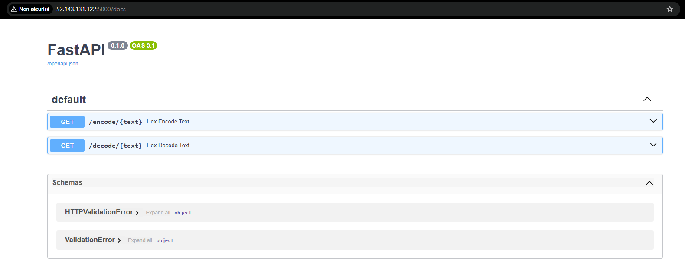

# 📦 Projet CI/CD & GitOps – `Appliquer les bonnes pratiques GitOps dans l'intégration et déploiement continu d'applications`

## 🎯 Objectif du projet

Mettre en œuvre un environnement d’intégration et de déploiement continu (CI/CD) en appliquant les bonnes pratiques **GitOps**.  
Le tout basé sur une application Python containerisée, avec des tests unitaires et un pipeline automatisé conditionnant les merges à la réussite des tests.

---

## 🛠️ Environnement utilisé

| Élément                   | Détail                                                                 |
|---------------------------|------------------------------------------------------------------------|
| 🧰 Plateforme CI/CD       | GitLab CE auto-hébergé sur Azure                                      |
| 🖥️ Infrastructure         | 2 VMs Azure déployées via Terraform (1 GitLab + 1 GitLab Runner)      |
| ⚙️ Provisionning          | Ansible (Docker, GitLab Runner, NGINX, Certbot...)                    |
| 📦 Déploiement            | Docker / Shell                                                         |
| 🔍 Supervision (optionnel)| Docker logs (local)                                                    |

---

## 🧱 Architecture déployée

```
[ Dev ]
   │
   ├──> GitLab CE (CI/CD + Git)
   │     └──> GitLab Runner (Shell + Docker)
   │            └──> Build + Test + Deploy
   │
   └──> VM Azure exposée via HTTPS (Nginx + Certbot)
```


---

## ⚙️ Pipeline `.gitlab-ci.yml`

```yaml
stages:
  - test
  - build
  - deploy

test:
  stage: test
  image: python:3.10
  tags: [auto]
  script:
    - pip install -r requirements.txt
    - python3 -m pytest
  only: [main, merge_requests]

build:
  stage: build
  tags: [auto]
  script:
    - docker build -t rda-devops-app .
  only: [main]

deploy:
  stage: deploy
  tags: [auto]
  script:
    - docker stop rda-devops-app || true
    - docker rm rda-devops-app || true
    - docker run -d --name rda-devops-app -p 5000:5000 rda-devops-app
  only: [main]
```

[Pipeline fonctionnel](images/stages%20build%20&%20deploy.png)

---

## 🔬 Tests unitaires

Les tests sont déclenchés automatiquement via `pytest`.  
> 📌 Si un test échoue, le pipeline échoue et la merge request est bloquée (simulation réalisée sur GitLab CE).

Extrait du test :

```python
from main import convert_to_hex

def test_convert_to_hex():
    assert convert_to_hex(255) == "0xff"
```



---

## 🧪 Simulation de test cassé

Une branche `test-fail` a été créée avec un test volontairement erroné.  
Le pipeline échoue correctement et empêche le merge (du point de vue des développeurs sans rôle admin).


---

## 🚀 Déploiement final

Une fois l’image Docker construite, elle est automatiquement lancée sur la VM Runner.

> Accès public : `http://<rda-runner-vm>:5000/hex?value=255`  
Retour :
```json
{"hex": "0xff", "value": 255}
```


---

## 🧠 Conclusion

Ce projet m’a permis de :
- Mettre en place une chaîne CI/CD complète sur GitLab auto-hébergé
- Appliquer des pratiques GitOps : merge via pipeline, tests automatisés, infrastructure versionnée
- Maîtriser les outils : Terraform, Ansible, GitLab CI/CD, Docker, Flask, Pytest

L’environnement est **fonctionnel, reproductible et démontrable** à tout moment.

---

## 👨‍💻 Crédits

   
Formation **DevOps** – Simplon.co, Montpellier  
Brief : _CICD & GitOps_  
© 2025